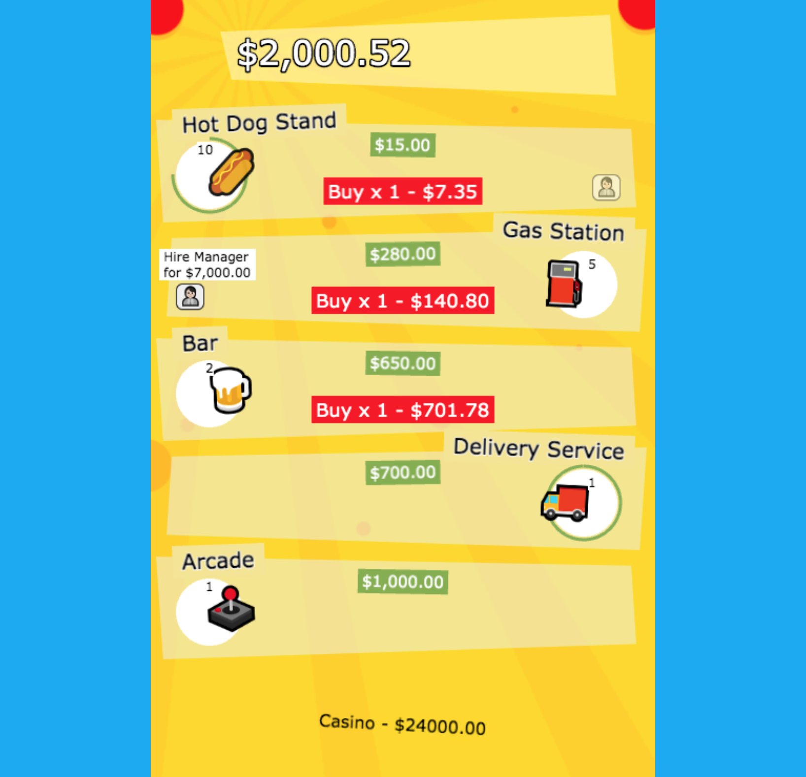

### About

Solution to Game Closure's Code Challenge:

Create a basic clone game of Adventure Capitalist business sim game with the following requirements:

- [x] Buy and upgrade businesses. There should be several business types to choose from.
- [x] Make money from a business. (i.e. you click on a business and in a certain amount of time you get money – see web implementation above.)
- [x] Hire managers, so that money is made automatically.
- [ ] When you close the game, next time you open it, you should see the money that your businesses made for you.\*

## Game Screenshot

<a href="https://naknick.com/biz-sim-game/" rel="promo video"></a>

## Available Scripts

## 👷 To run the game in the development mode

```
npm run start
```

## 🏗 To build and serve locally

```
npm run build
```

### Comments on the implementation

- The game is leveraging [Phaser 3](http://phaser.io/) JavaScript Game Framework bundled and compiled using [Parcel](https://github.com/parcel-bundler/parcel).
- Decision behind using Phaser was mainly based on the time limitation as Phaser supports game loop, tweens, animation, sound and inputs out of the box. However React.js and Vanila JavaScript were considered as a second and third choices accordingly.
- Tech implementation is mainly focused on the front-end side as the aim was to provide a relatively polished UI and leveraging server side only for the game state persistance seemed as an overkill. Instead browser's localStorage has been used for that.
- The last feature from the requirement above has been omitted due to time limit. However the game state is persistent and being saved upon closing browser window/tab so that when the player opens the game (in the same browser) he will be able to start from where he left off.
- Used [AdVenture Capitalist Wiki](https://adventure-capitalist.fandom.com/wiki/Businesses) as a reference for some of the values (coefficients), formulas and general game information

### Room for improvements

- Add Unit Testing for click/tap events, game logic etc.
- Pack multiple images into one atlas for optimization.
- Add sprite animation to improve UI experience.
- Add game tutorial.
- Optimize better for mobile experience.
- Reduce build size (the current JavaScript build file is 1.2MB).
- Should I have more time I would approach the last item on the requirement list. The way to do it is simple. Every business instance keeps the state for current revenue and delay(considering it runs automatically with the manager). So once player leaves the game (closes browser tab) I would be able to calculate amount of money each business has made based on the time when player opens the game.

---
